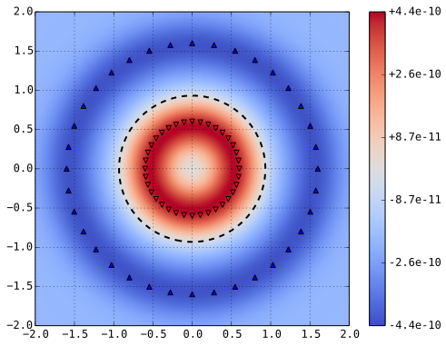
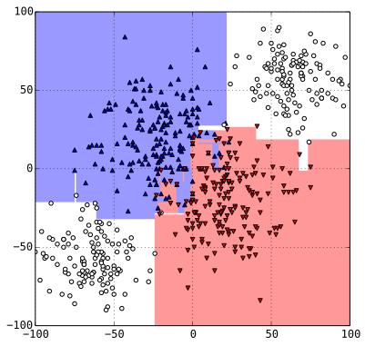
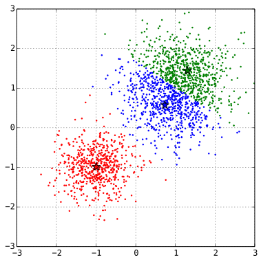

Scala's Pattern Recognition and Machine Learning
====


sample codes of machine learning models and algorithms written in Scala, for the educational purpose in data science.

## Documents

- [Scalaで実装するパターン認識と機械学習 (PDF)](https://nextzlog.dev/mine.pdf) [(HTML)](https://nextzlog.dev/mine.html)

## Chapter 1

### Nearest Neighbors

```sh
$ java -jar build/libs/mine.jar KNN
$ java -jar build/libs/mine.jar LR
$ java -jar build/libs/mine.jar NBC
```


### Linear Regression


### Naive Bayes Classifier


## Chapter 2

```sh
$ java -jar build/libs/mine.jar MLP
$ java -jar build/libs/mine.jar SGD
$ java -jar build/libs/mine.jar RNN
```

### Multi-Layer Perceptron


### Plain SGD vs AdaDelta


### Recurrent Neural Network


## Chapter 3

```sh
$ java -jar build/libs/mine.jar SVM
```

### Linear SVM


### Kernel SVM




## Chapter 4

```sh
$ java -jar build/libs/mine.jar DT
```

### Decision Tree




### AdaBoost


### Ensemble


## Chapter 5

```sh
$ java -jar build/libs/mine.jar LDA
```

### Latent Dirichlet Allocation

```
0,7,14,21,28,35,42,49,56,63,70,77
5,10,15,20,25,30,40,45,50,55,60,65,75,80
3,6,9,12,18,24,27,33,36,39,48,51,54,57,66,69,72,78
2,4,8,16,22,26,32,34,38,44,46,52,58,62,64,68,74,76
```

## Chapter 6

```sh
$ java -jar build/libs/mine.jar GMM
```

### K-Means




### EM Algorithm


### VB-EM Algorithm


## Dependencies

- Python3.8
- numpy
- scipy
- matplotlib
- cartopy
- geos

## Build

```sh
$ gradle build
```

## Contribution

Feel free to make issues at [nextzlog/todo](https://github.com/nextzlog/todo).
Follow [@nextzlog](https://twitter.com/nextzlog) on Twitter.

## License

### Author

[無線部開発班](https://nextzlog.dev)

### Clauses

[BSD 3-Clause License](LICENSE.md)
